# Lab Report - Week 2

## How to log into a course-specific account on ieng6


This blog will discuss how to be able to log into a course-specfic account on ieng6 and the steps you need to take in order to do so. 

It will also show you how to run some commands and how to optimize remote running.

---
### __Installing Visual Studio Code__
You would first want to go to the [Visual Studio Code Website](https://code.visualstudio.com/).
From there, you follow the instructions on how to download and install it on your computer, depending on what version you're on.

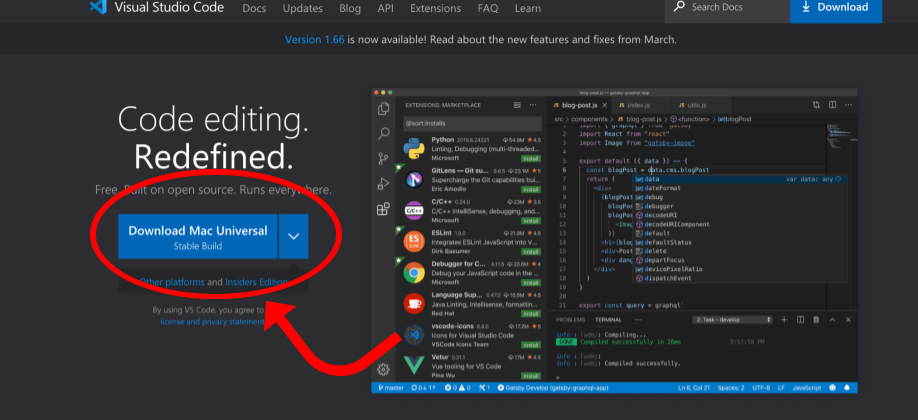

Once you have it installed, open VS Code, and it shoud look similar to this (keep in mind that the menu and color may vary depending on your settings):

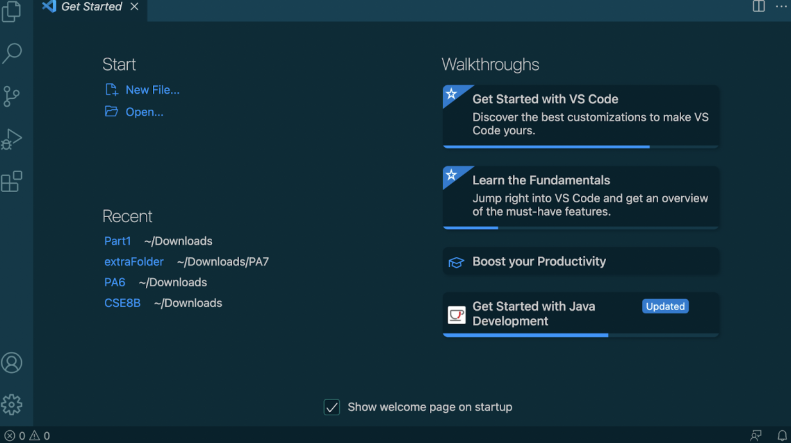

---
### __Remotely Connecting__
Now that you have downloaded VS Code, we'll discuss how to connect your course-specific account through a remote computer.

If you're on Windows, you'll first have to install [OpenSSH](https://docs.microsoft.com/en-us/windows-server/administration/openssh/openssh_install_firstuse).

If you don't know you're course-specific account for the class, you can look it up here:
[https://sdacs.ucsd.edu/~icc/index.php](https://sdacs.ucsd.edu/~icc/index.php)

We'll then be using Visual Studio Code to connect to the remote computer.

You'd first want to open the Terminal in VS Code. This can be done by doing "Ctrl + `" or go to "Terminal" then "New Terminal" in the menu. Then you will enter this command in the terminal, however, you'll replace the "zz" with the letters of your course-specific account. 

`$ ssh cs15lsp22zz@ieng6.ucsd.edu`

If this is the first time you'll be connecting to this server, you may be prompted with this message:

`The authenticity of host 'ieng6.ucsd.edu (128.54.70.227)' can't be established.`

`RSA key fingerprint is SHA256:ksruYwhnYH+sySHnHAtLUHngrPEyZTDl/1x99wUQcec.`

`Are you sure you want to continue connecting (yes/no/[fingerprint])?`

If you do get this message, answer with yes. Then, you will type in your password. Once you have logged in, it should look similar to this:

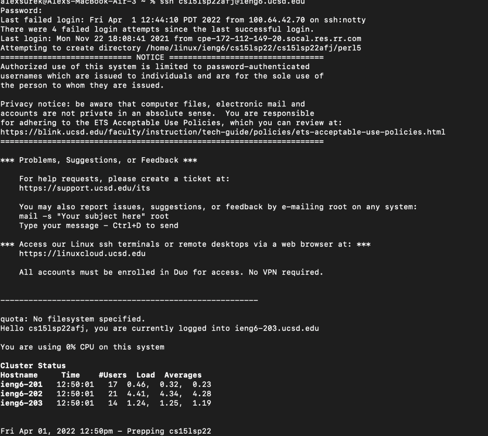

Once you've finished, you are now connected to a computer in the CSE basement!

---
### __Running Some Commands__
Now that you're connected, here's a list of commands you can feel free try out:

* `cd` - changes directory or moves the user back to the home directory
* `mkdir` - makes a directory
* `ls` - lists the files in the current directory (you can also do `ls -a` to list ALL files)
* `cp` - copies the files in current directory
* `pwd` - will print the path of the current directory

Below are a few examples of the expected or similar output when running these commands:

__Using `ls` and `ls -a`__

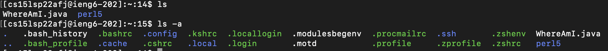

As you can see, when using just `ls`, it'll only list files of the current directory, but when using `ls -a`, it listed all files.

__Using `mkdir`__

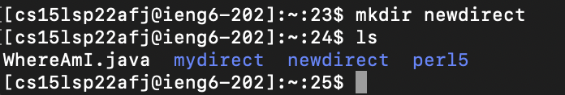

A new directory named "newdirect" has been made, and is shown when using the command `ls`

__Using `cd`__

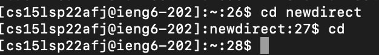

Used `cd` to move to the "newdirect" directory then typed in `cd` again to return back to the home directory

---
### **Moving Files with scp**
Now that we have learned some basic commands, we can now try to move files with scp. Scp will copy a file, or multiple files, from your computer to a remote computer. 

Firstly, create a file on your computer named WhereAmI.java, open it with Visual Studio Code, and put the following contents in it:

```
class WhereAmI {
  public static void main(String[] args) {
    System.out.println(System.getProperty("os.name"));
    System.out.println(System.getProperty("user.name"));
    System.out.println(System.getProperty("user.home"));
    System.out.println(System.getProperty("user.dir"));
  }
}
```

(This file will essentially tell the user what location the file is being run on.)

Run it using javac and java, on your computer. You should get an output similarily structured like this:

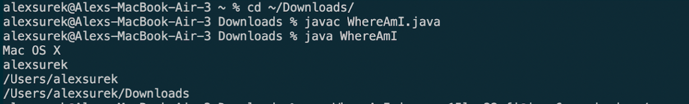

Now, in the terminal from the directory you made this file, run the following command (make sure to replace 'zz' with your username):

`scp WhereAmI.java cs15lsp22zz@ieng6.ucsd.edu:~/`

You should be prompted for a password, similar to logging in with `ssh`. Then, log into your SSH account again, and use `ls`. You should be able to see it on your home directory, and you can use it using javac and java!

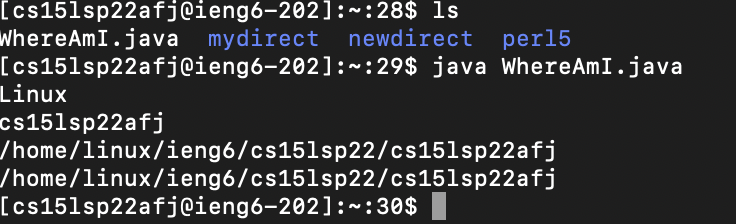

___
### **Setting an SSH Key**
Logging into your SSH account can get frustrating and even tim consuming, especially since you're unable to see your password when typing it in. Luckily, we can make this process easier by setting an SSH Key!

Here are the steps to set this up. On your computer (you can use VS Code), run this command:

`$ ssh-keygen `

You should get the following after pressing enter.
```
Generating public/private rsa key pair.

Enter file in which to save the key (/Users/<user-name>/.ssh/id_rsa): /Users/<user-name>/.ssh/id_rsa

Enter passphrase (empty for no passphrase): 
```
**DO NOT** enter a passphrase, just press enter and continue.

The following message should appear, it will ask for your passphrase again. Do not enter a passphrase, and continue.

```
Enter same passphrase again: 

Your identification has been saved in /Users/<user-name>/.ssh/id_rsa.

Your public key has been saved in /Users/<user-name>/.ssh/id_rsa.pub.

The key fingerprint is:
SHA256:jZaZH6fI8E2I1D35hnvGeBePQ4ELOf2Ge+G0XknoXp0 <user-name>@<system>.local
The key's randomart image is:
+---[RSA 3072]----+
|                 |
|       . . + .   |
|      . . B o .  |
|     . . B * +.. |
|      o S = *.B. |
|       = = O.*.*+|
|        + * *.BE+|
|           +.+.o |
|             ..  |
+----[SHA256]-----+
```
After doing so, two new files has been created on your system. The private key (in a file id_rsa) and the public key (in a file id_rsa.pub), which is stored in the `.ssh` directory. 

Now we copy the **public** key to the `.ssh` directory of your user account. You do this by doing the following (again, replacing 'zz' with your username):

```
$ ssh cs15lsp22zz@ieng6.ucsd.edu
<Enter Password>

# now on server

$ mkdir .ssh

$ <logout>

# back on client

$ scp /Users/<user-name>/.ssh/id_rsa.pub cs15lsp22zz@ieng6.ucsd.edu:~/.ssh/authorized_keys

# You use your username and the path you saw in the command above
```

Once you're done, you should be able to log into your SSH account without having to enter your password!

As you can see below, no password was asked when logging in.

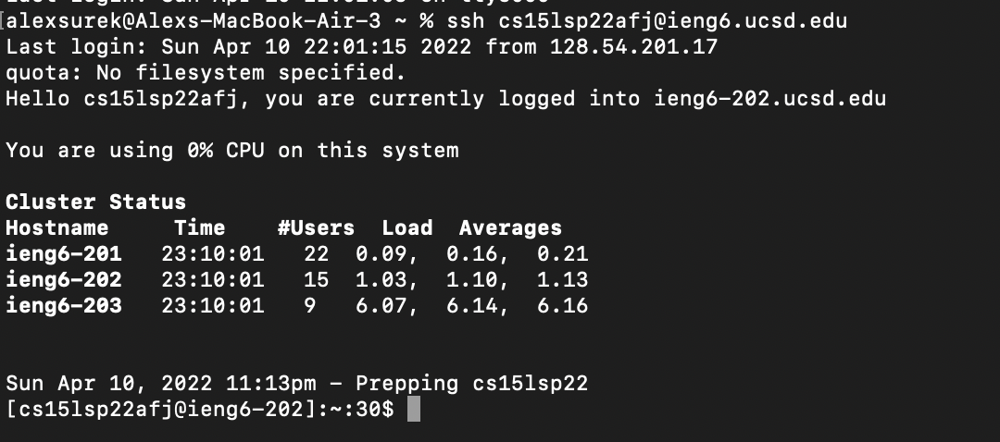

---
### **Optimizing Remote Running**
Typing every individual command at a time can be time consuming and tedious. Fortunately there are methods to save time and optimize the process. 

For example, when logging into your account, you can type a command in "quotes" so it runs it on the remote server and logs you out right after.

In the example below, we typed in "`ls`" after the `ssh` command, and it listed the files from the home directory.
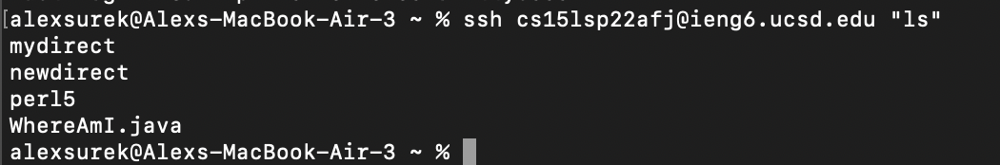

Another method is that you can run multiple commands at once by separating each of them with semicolons. This can be done like as shown below.

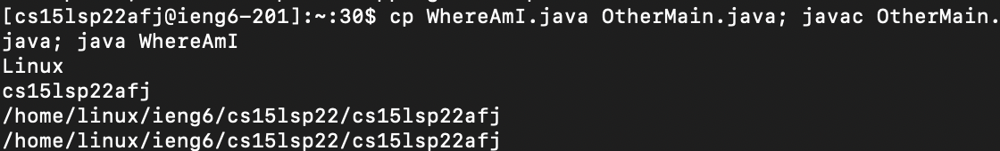

---
### **Conclusion**
If you've followed these steps correctly, you're now set up and know how to log into your course-specific account.  

You know how to connect remotely and even know a few basic commands to use. And hopefully this tutorial helped logging in easier for you with an SSH key and save you time when you are remote running.
