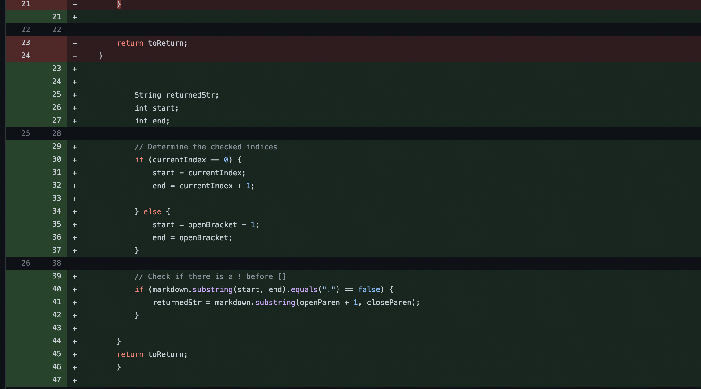
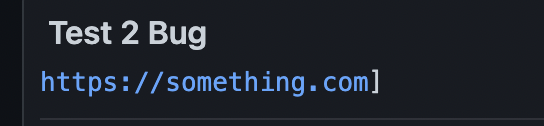
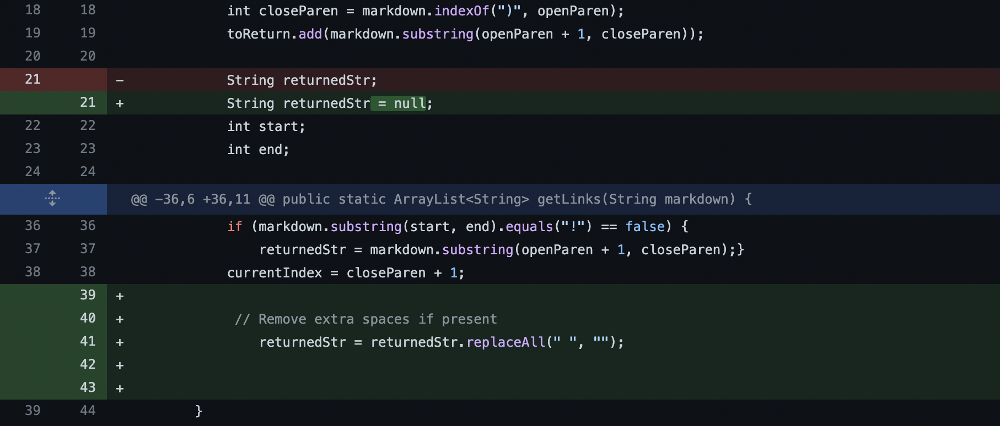
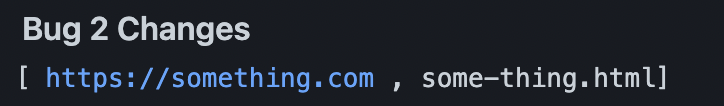
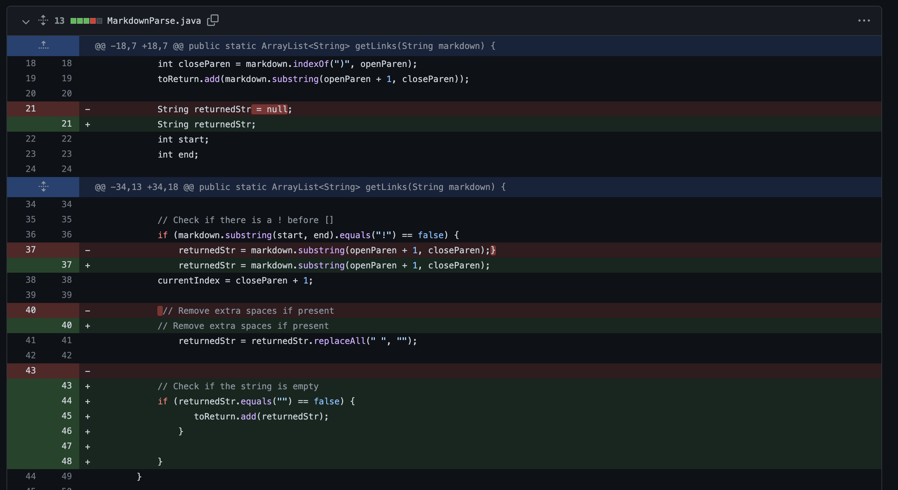
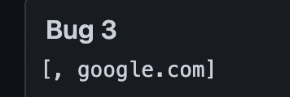

# Lab Report 2 - Week 4

## Lab 3 Bug Changes

In Lab 3, we were given a java file named MarkdownParse.java. The code within the file worked for a few test cases, but with certain test cases, there will be an error. Our lab group fixed the code, so there will no longer be any errors when running these test cases. Below are examples of three bugs in the code that we fixed.

---

### Bug #1
The first bug we tried to fix, was checking whether or not there was an "!" in the input. This is because, typically if there was an exclamation point, it would mean that the user is trying to provide an image link, however this is not what we want. 

Here is the changes we made:

 

We added an if statement to check whether or not if there was an "!" in the beginning of the input. If there is an exclamation point, then the code will ignore this input, and continue on. 

We used [Test File 2](https://github.com/asurek1/markdown-parser2/blob/main/test-file2.md) to test whether or not if it works. 

When running the command prior to making the changes, we would get this:

(there is supposed to be a bracket at the beginning, a mistake in copy/paste)

This is an incorrect output because the test file used provides an image, not the type of link that we want to save. This is a bug in the program because the original code didn't make a case to check if an image link was provided. This relates to our symptom because the output we got still provided the image links, even though we shouldn't be adding those to the list of links. 

---
### Bug #2
Another bug we encountered during the code was empty spaces that were added in the test files. When returning the list of links, we don't want to have any unnecessary spaces in the links.

The changes we made to fix this are: 

We called the replaceAll method to remove any spaces that are within the parenthesis. 

To test this bug, we used [Test File 1](https://github.com/asurek1/markdown-parser2/blob/main/test-file.md).

Prior to fixing the code, we got this output when using this file:

This is an incorrect output as there shouldn't be any spaces in the links. As you can see, there is a space in front and at the end of the first link in the list. This is a bug in the code since the original code will save anything that is between the open and closed parenthesis, regardless if there is anything wrong within it. This relates to the symptom since the output given still has spaces within it.

---
### Bug #3
A third bug we fixed, was to check whether or not there was an empty string in the input (i.e. there was no link provided within the parenthesis). 

We fixed this by doing the following changes:

We made an if statement to check whether or not the string provided is empty. If it is empty, then we don't add it to the list of links, but if isn't, then it will be added to the list.

The test file we used to this was [Test File 3](https://github.com/asurek1/markdown-parser2/blob/main/test-file3.md).

Before we made any changes to the code, we would get this output:

This is an incorrect output as there is an empty string before "google.com.". This is because in the test file we used, we didn't add a link within the parenthesis. This a bug in the code as the original didn't have a way to check whether or not the string would be empty. This relates to the symptom as we can see that the output still shows the empty string in the list.