# Lab Report 3 - Week 6

## Lab 5 Group Choice Options
In Lab 5, we were given a choice of options of things to do after we've finished the required tasks. In this report, we'll go over those options, along with a description of each option.

### Streamlining SSH Configuration
This task had us go into a file named config under .ssh, creating said file if it doesn't exist, pasting some lines into the file. 

This makes it so when we're logging onto ieng6, we're no longer required to type our long username. Instead, we're able to just type "ssh CSE15L" and we'll be logged in, saving a bunch of time.

Since I wasn't able to locate config file on the Terminal, I tried to find it through my folders by typing this under "Go > Go to Folder":

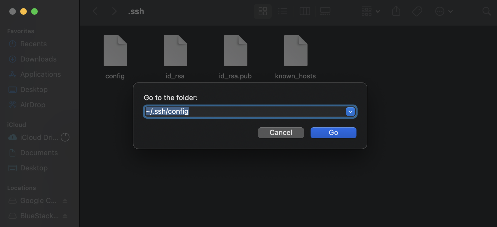

As you can see, doing so directed me to the .ssh file and displays config in the file.

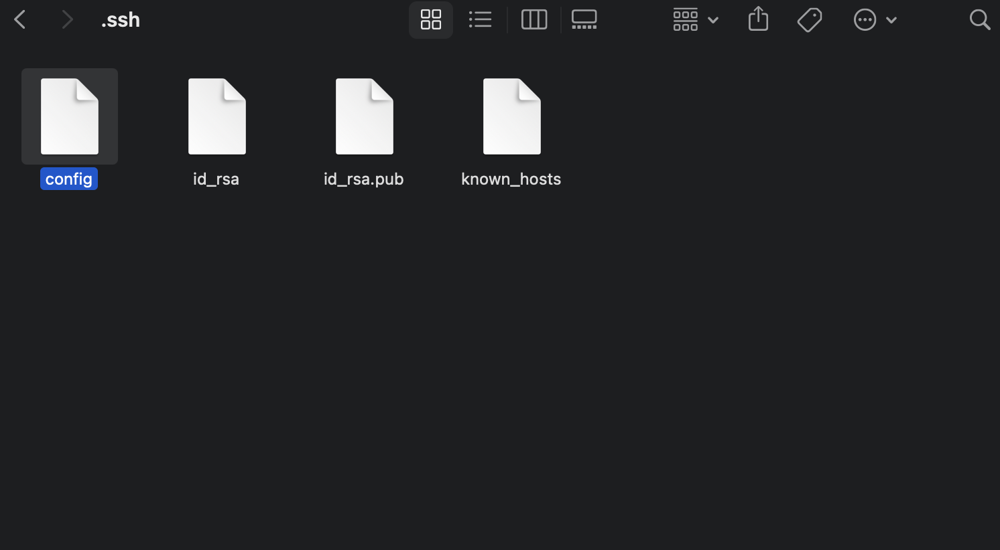

I opened config and pasted the following lines into it:

```
Host CSE15L
    HostName ieng6.ucsd.edu
    User cs15lsp22afj
```

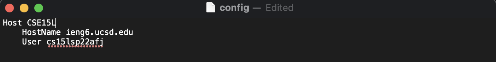

Now once I try to log into my ieng6 account, I no longer need to type such a long command. I can just use "ssh CSE15L" to log in.


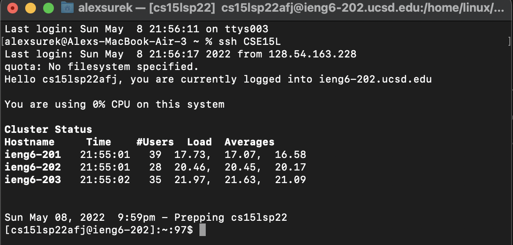


I can also use other commands and use "CSE15L" instead of typing out my whole username. Below I made a copy of TestFile.java to my account.

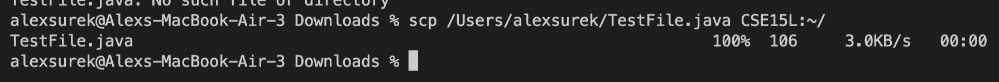

And here it is on my account:

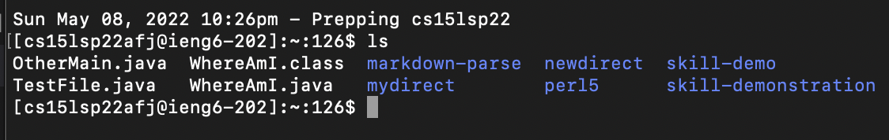

---
### Setup Github Access from ieng6
In this task, it made it possible for us to be able to push and commit changes on GitHub from our terminal. 

We had to make a new key on GitHub, which can be seen if we go to "Settings > SSH and GPG Keys" on GitHub.

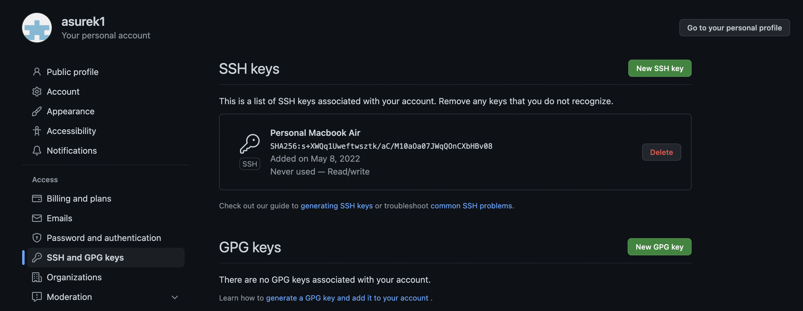

And here is the public and private key on my ieng6 account:

Public:

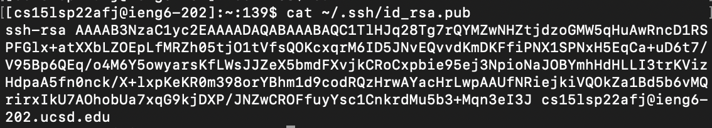

Private:

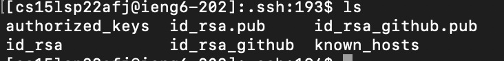


---
### Copy whole directories with scp -r
The final task we did was copying whole directories into out ieng6 accounts. This will save a lot of time when trying to copy files into are account since we won't have to copy file after file each time. 

We first copy the directory by typing the following command (you would add your username in the correct location):

`scp -r . cs15lsp22@ieng6.ucsd.edu:~/markdown-parse` 

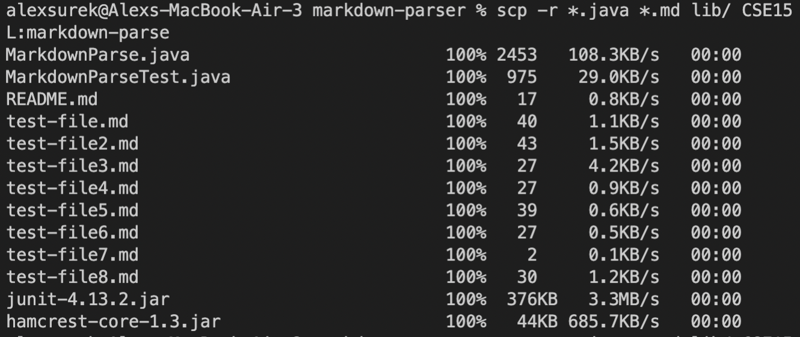

Now the directory has been copies onto our ieng6 account, so we can try to run the file and see if it works.

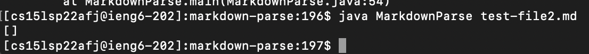

As you can see, we successfully were able to copy the directory and now we can run the file from our accounts.

You can make this process by typing this command instead:

`scp -r *.java *.md lib/ cs15lsp22@ieng6.ucsd.edu:markdown-parse` 

This makes it so it only copies over java and md files, instead having to copy every single file.

You can also use a semicolon to run the command on the same line, instead of doing each command one at a time.

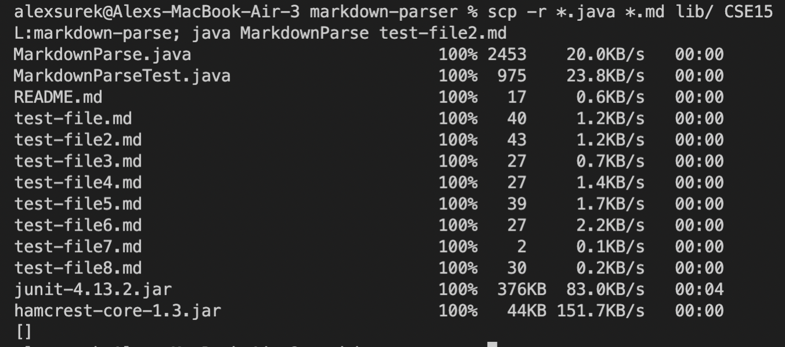
