# Lab Report 4 - Week 8
During week 7, we reviewed another lab group's MarkdownParse file, and tested if it worked with their test cases, as well as our own test cases. They also reviewed our own MarkdownParse. In this report, we will use some snippets to test both our lab group's MarkdownParse and the group we reviewed MarkdownParse.

Here are the links of the MarkdownParse files we will be reviewing:

[My MarkdownParse](https://github.com/asurek1/markdown-parser)

[Reviewed MarkdownParse](https://github.com/brandoluu/markdown-parser)

---
## Snippet 1
The first snippet we will be testing is the following:

```
`[a link`](url.com)

[another link](`google.com)`

[`cod[e`](google.com)

[`code]`](ucsd.edu)
```

Using the [CommonMark demo site](https://spec.commonmark.org/dingus/), the expected output from the above snippet is this:

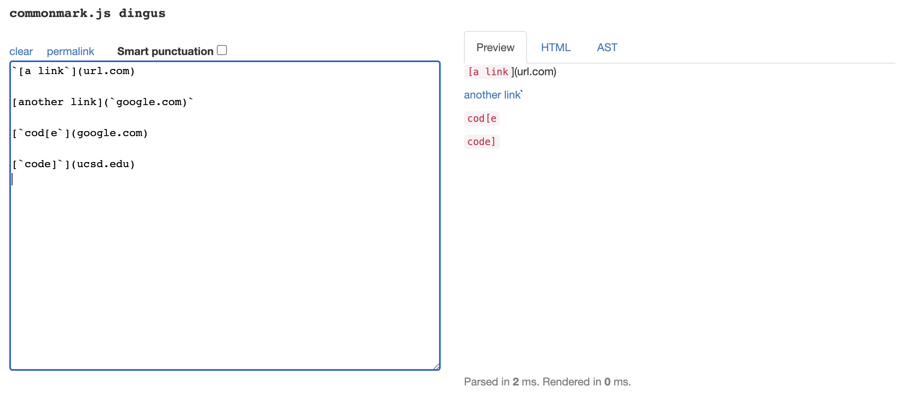

Based on the output given from CommonMark, I expect that the list of links would provide:
 `['google.com, google.com, ucsd.edu]`.

 Here is how I implemented the test on MarkdownParseTester:

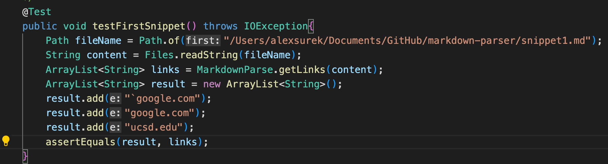

And this is the output that I got when I try running the test:

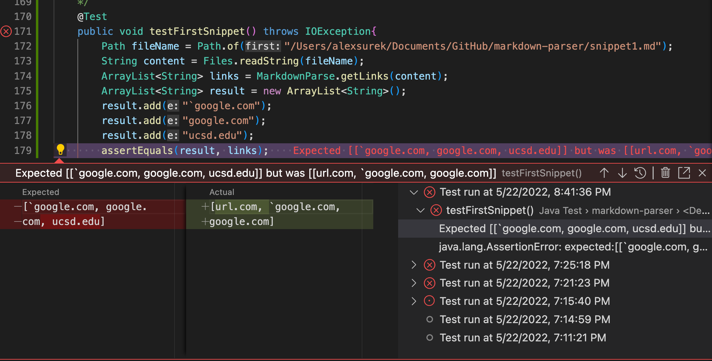

As you can see the test, failed and it expected to include "url.com" in the list, but excluding "ucsd.edu".

Using the same implemenation of the test I did on my tester, I tested the same snippet on the MarkdownParse I reviewed.

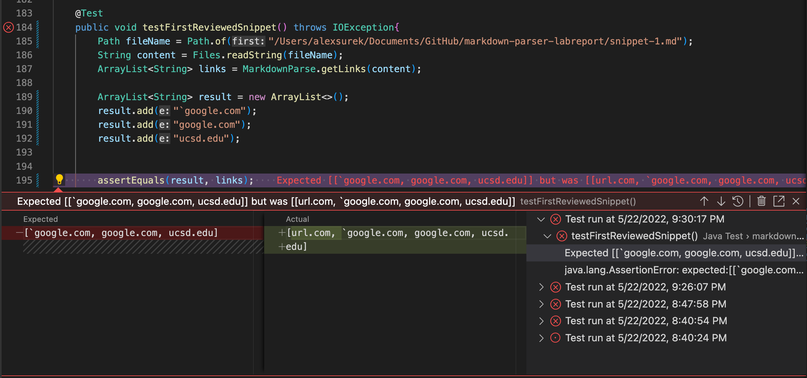

Their test also failed, with the same failure.

---
## Snippet 2
The next snippet we're doing is this:
```
[a [nested link](a.com)](b.com)

[a nested parenthesized url](a.com(()))

[some escaped \[ brackets \]](example.com)
```

When using CommonMark, we get the following output:

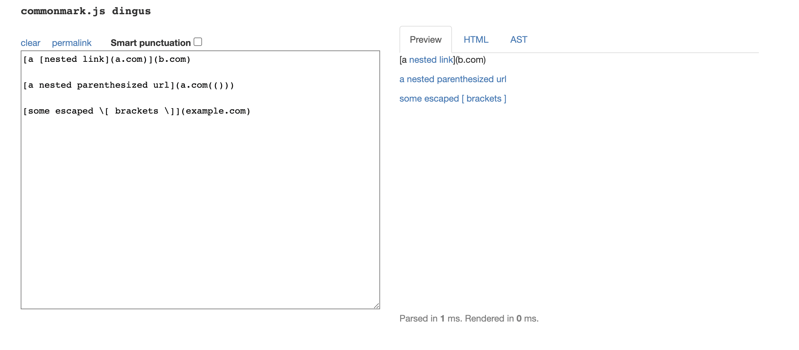

Based on the output from CommonMark I think the list of links we'll get will look something like:

`[a.com, a.com(()), example.com]`

Here is how I implemented the test for this snippet:

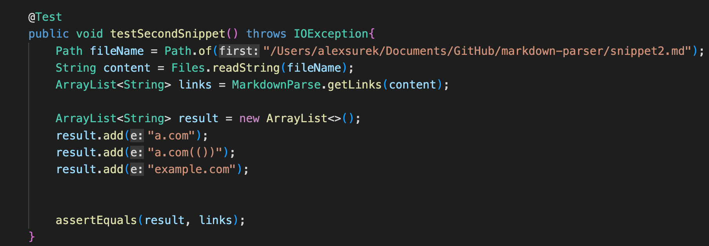

And the result I got after running this test was:

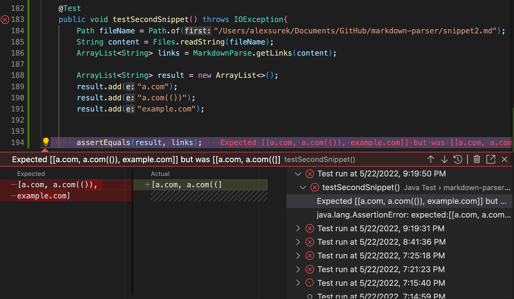

When runing the test, the output given from our MarkdownParse didn't match the expected output. 

Using the same test, I tested on the other groups MarkdownParse, and the result given was:

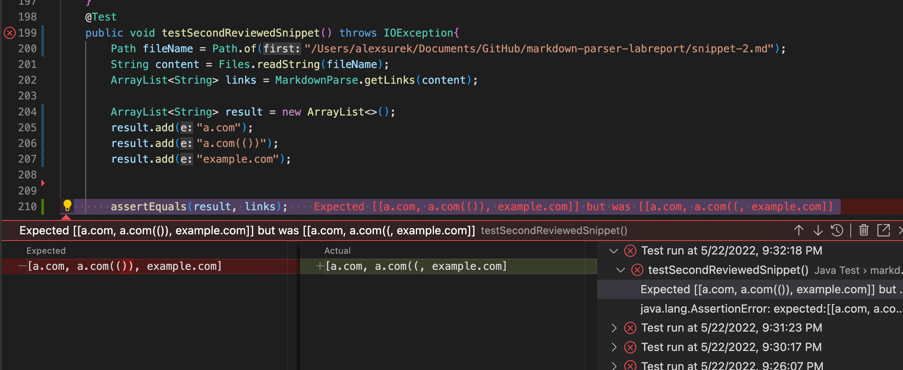

This time around, our fails didn't match. Their actual output contained "example.com" in their list, which is more accuate to the expected output. Meanwhile, ours didn't contain "example.com".

---
## Snippet 3
The last snippet we'll be testing is the following:

```
[this title text is really long and takes up more than 
one line

and has some line breaks](
    https://www.twitter.com
)

[this title text is really long and takes up more than 
one line](
https://sites.google.com/eng.ucsd.edu/cse-15l-spring-2022/schedule
)


[this link doesn't have a closing parenthesis](github.com

And there's still some more text after that.

[this link doesn't have a closing parenthesis for a while](https://cse.ucsd.edu/


)

And then there's more text
```

Here is what the expected should look like based off of CommonMark:

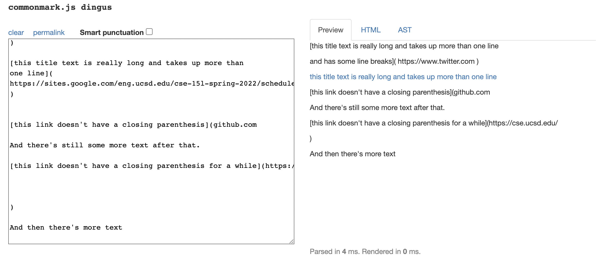

Based off of the output from CommonMark, we can expect the link of lists to look like this:

`[https://sites.google.com/eng.ucsd.edu/cse-15l-spring-2022/schedule]`

Here is how I implemented the test in MarkdownParseTester: 

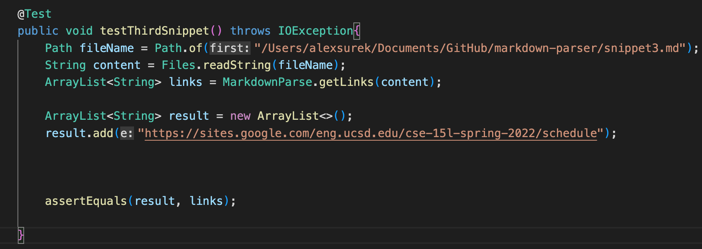

And here is result after running that test:

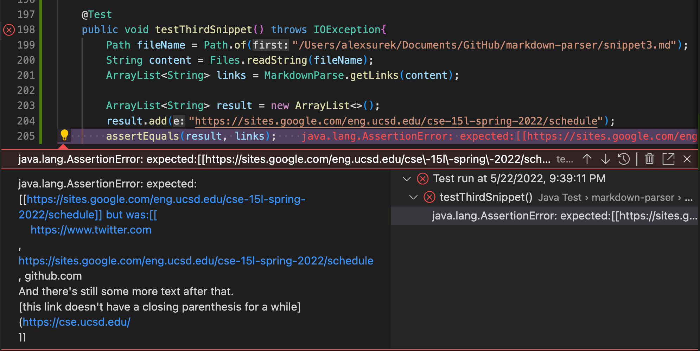

This time, we're not given an actual output of a list of links, we're now given an AssertionError. 

We'll run the same test, but this time we'll check it on the reviewed MarkdownParse.

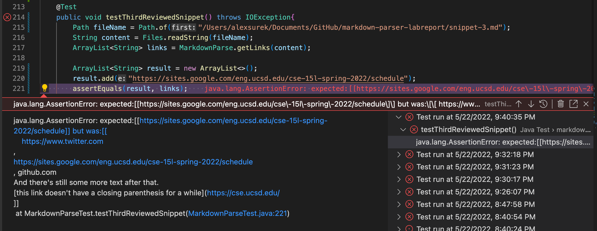

When doing this test on the other MarkdownParse, we're also given an AssertionError.

---
## Changes we can make

### Snippet 1
A change we can make to our code in order for it to help pass Snippet 1, is to make it remove all backticks when going through inside of "[]" and "()". This will make it so the backticks are ignored, and won't affect the output of the link of lists.

### Snippet 2
A change to our code that we can do to pass Snippet 2 is maybe having it so once we find the first "[" we ignore any open brackets that come after, until we find the closed bracket. For closed brackets, we can continue to go through the string until the very end and spot the very last "]" in the string, instead of finding the very first one.

### Snippet 3
Similar to the change in Snippet 1, we can fix our code so it can pass Snippet by removing any empty space from the string. This could help so we don't run into an AssertionError. 
