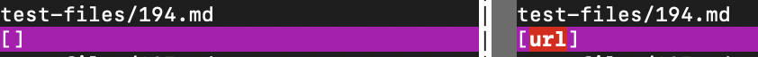
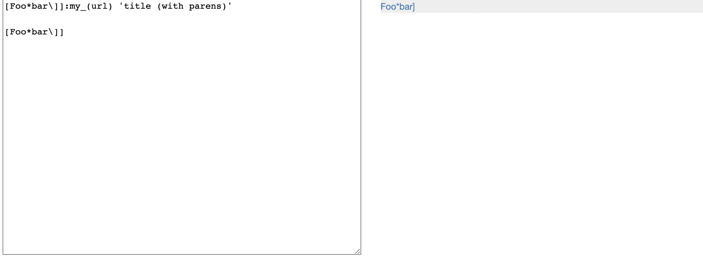
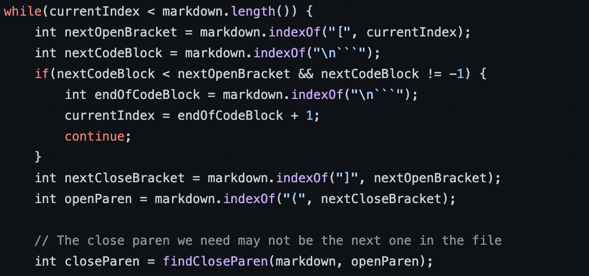
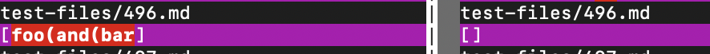
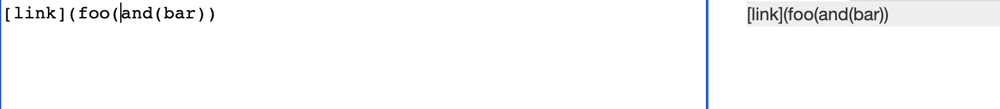
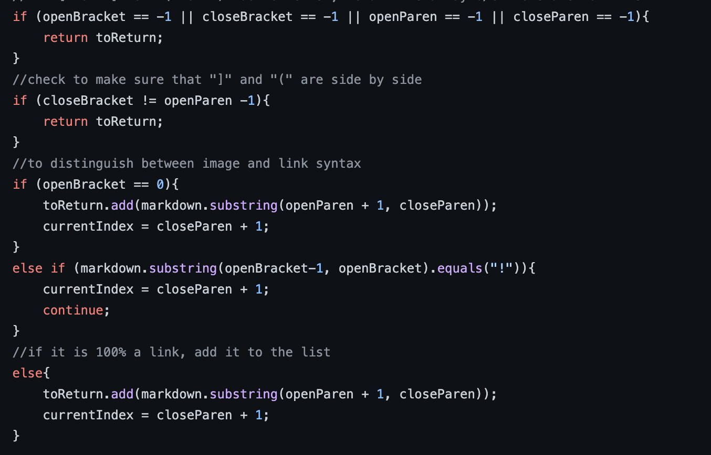

# Lab Report 5 - Week 10
During Lab 9, we ran multiple tests from the given test-files/ folder and ran them on our own implementation of MarkdownParse along with the given implementation from the lab. When comparing the two different outcomes using `vimdiff`, some tests got a different results than the other. In this report we'll go over some of the different outcomes, and try to come up with a way to fix the code so it prints out the right answer.

---
## Test #1
The first test we'll be looking at it is [test-files/194.md](https://github.com/nidhidhamnani/markdown-parser/blob/main/test-files/194.md).

When looking at vimdiff, this is the outcome we got for both implementations (the left being my own while the right is the one provided by the lab):

After looking at the test file, I'd say that my own implementation is the correct output, as none of the links that were provided in the test file were properly formatted. There should've been zero expected links.

When looking at the [Common Mark](https://spec.commonmark.org/dingus/) website, I still believe that the output should have zero links provided.

I'd say the bug that this implementation has can be fixed in here:

In this code, it finds where the "(" is located in the string after the "]". The problem with this is that it will ignore any text thats in between the closed bracket and the open parenthesis. A fix you can make is make it so that code makes sure that the open parenthesis is immediately after the last closed bracket, so that way if any text is in between the two, it won't be added to the list of links.

---
## Test #2
The second test file we will be looking at is [test-files/496](https://github.com/nidhidhamnani/markdown-parser/blob/main/test-files/496.md).

On vimdiff, these are the two different outcomes we get (the left is my implementation, right is the labs):

When looking into the test file, I think the labs implementation is correct, since I don't think any links should have been added to the list.

When checking Common Mark, this is the output that it is expected:

This means that no link was provided in the file, therefore, the list of links should be empty.

I think we can fix our code in here:

I think that the bug in our code is that we have no way of checking if there's anymore open parenthesis after the first open parenthesis. A way we can fix this is by adding a way to check that there's zero open parenthesis after the first one, and if there is, then the provided string should be ignored.
