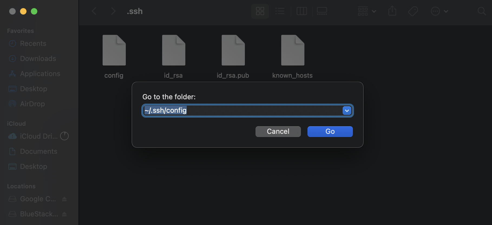
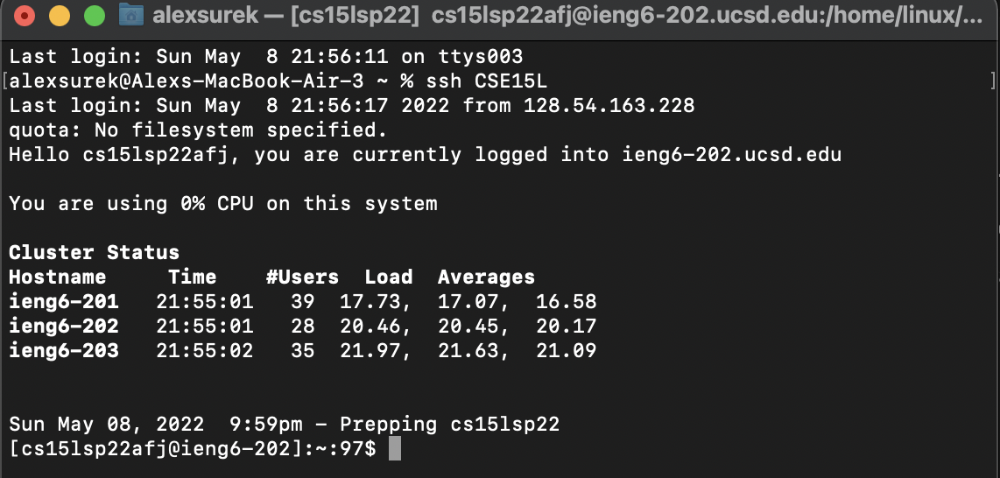

# Lab Report 3 - Week 6

## Lab 5 Group Choice Options
In Lab 5, we were given a choice of options of things to do after we've finished the required tasks. In this report, we'll go over those options, along with a description of each option.

### Streamlining SSH Configuration
This task had us go into a file named config under .ssh, creating said file if it doesn't exist, pasting some lines into the file. 

This makes it so when we're logging onto ieng6, we're no longer required to type our long username. Instead, we're able to just type "ssh CSE15L" and we'll be logged in, saving a bunch of time.

Since I wasn't able to locate config file on the Terminal, I tried to find it through my folders by typing this under "Go > Go to Folder":



As you can see, doing so directed me to the .ssh file and displays config in the file.


I opened config and pasted the following lines into it:

```
Host CSE15L
    HostName ieng6.ucsd.edu
    User cs15lsp22afj
```


Now once I try to log into my ieng6 account, I no longer need to type such a long command. I can just use "ssh CSE15L" to log in.

